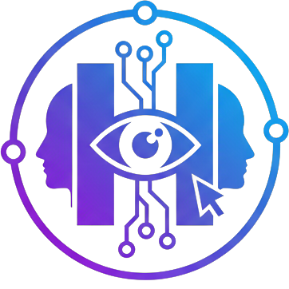

<p align="center">
  <a href="README.md">English</a> |
  <a href="README_KO.md">한국어</a> |
  <a href="README_JA.md">日本語</a> |
  <a href="README_ZH.md">中文</a> |
  <a href="README_FR.md">Français</a>
</p>

<p align="center">
  
</p>
# Human-to-Human CAPTCHA (H2H-CAPTCHA)

> **"Real-time verification by humans, for humans."**

H2H-CAPTCHA is an innovative security solution that replaces automated Turing tests with real-time human interaction. Instead of identifying traffic lights or bicycles, users ("Clients") are paired with human verifiers ("Validators") to perform interactive tasks.

---

## 🏗 Architecture

The system is built on a robust event-driven architecture using **Spring Boot** and **WebSockets**.

### 1. Backend (Kotlin + Spring Boot)
-   **WebSocket (STOMP)**: Handles real-time bi-directional communication.
-   **Matching Service**:
    -   Manages separate queues for Clients and Validators.
    -   Performs instant 1:1 matching.
    -   Handles session lifecycle (connect, disconnect, timeout).
-   **In-Memory Management**: Operates entirely in-memory (`ConcurrentHashMap`) for maximum speed. Client history (blacklist and failure counts) is preserved for 30 minutes even after disconnects to enhance security.

### 2. Frontend (Vanilla JS + HTML5)
-   **Screen Mirroring**:
    -   Captures Client's mouse coordinates and screen resolution.
    -   Validator's dashboard dynamically resizes to match the Client's aspect ratio, ensuring pixel-perfect observation.
-   **Interactive Canvas**:
    -   Dual-coordinate system: Sends both Global (screen-relative) and Local (canvas-relative) coordinates to ensure drawing accuracy across different screen sizes.

---

## 🎮 Interactive Challenges

The system supports four distinct verification modes, controlled by the Validator:

1.  **🖱️ Mouse Tracking (Passive)**
    -   **Logic**: The Validator observes the Client's natural mouse movements.
    -   **Goal**: Detect bot-like linear jumps or instant teleports.
    -   **Tech**: Real-time relative coordinate broadcasting (0.0 - 1.0).

2.  **✏️ Drawing (Active)**
    -   **Logic**: Validator assigns a topic (e.g., "Apple"). Client draws it on a canvas.
    -   **Goal**: Verify human creativity and motor control.
    -   **Tech**: Canvas API with relative coordinate synchronization.

3.  **👊 Rock-Paper-Scissors (Reaction)**
    -   **Logic**: Validator sends a challenge (e.g., "Rock"). Client must choose the winning move (e.g., "Paper") within a reasonable time.
    -   **Goal**: Test cognitive response and rule understanding.

4.  **💬 Chat (Turing)**
    -   **Logic**: Free-form text conversation.
    -   **Goal**: The ultimate Turing test.
    -   **Tech**: Real-time messaging with "Typing..." indicators.

---

## 🚀 Getting Started

### Prerequisites
-   **Java 21** (or Docker)
-   Port 8080 available

### Running with Docker (Recommended)
This handles all dependencies automatically.

```bash
docker-compose up --build
```

### Running Manually
```bash
./gradlew bootRun
```

### How to Use
1.  Open `http://localhost:8080`.
2.  **Tab 1**: Select **"I am a User (Client)"**.
3.  **Tab 2**: Select **"I am a Validator"**.
4.  The system will match you instantly.
5.  Use the Validator console to switch tasks and verify the Client.

---

## 🛡️ Security Features
-   **UUID-based Routing**: Each session creates a unique, ephemeral UUID for secure message routing.
-   **Isolation**: Clients cannot communicate with other Clients.
-   **Privacy**: No IP logging or persistent storage. Data exists only during the active WebSocket session.

---
© 2025 H2H Captcha Project.